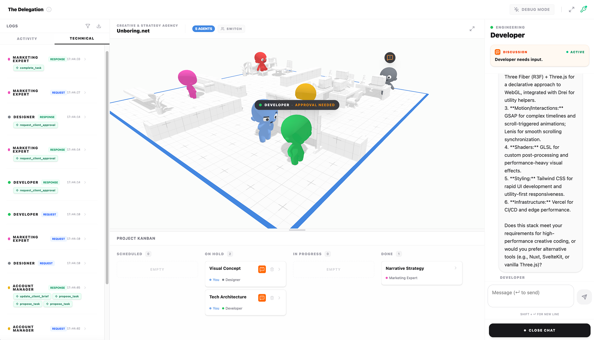

# The Delegation

### What if you could stop prompting & start delegating to a team of AI agents in a living 3D office?

<p align="center">
  
</p>

**The Delegation** is a high-performance 3D simulation built with **Three.js WebGPU** where autonomous LLM-powered characters collaborate in a shared physical workspace.

Unlike traditional "chat-only" agent frameworks, these characters are _embodied_: they navigate a 3D environment, claim workstations, express emotions through animations, and interact with the user and each other to fulfill complex project briefs.

---

## Features

### Advanced Agency System

- **Orchestrated Workflow:** A specialized agency service manages the project lifecycle from initial briefing to final delivery.
- **Autonomous Task Management:** Agents propose their own tasks, request client approval when stuck, and update a real-time Kanban board.
- **Tool-Augmented Intelligence:** Deep integration with LLM function calling, allowing agents to "act" (e.g., `propose_task`, `request_approval`) within the simulation.

### Embodied Simulation

- **Hybrid GPU/CPU Architecture:** High-efficiency character instancing using WebGPU Compute Shaders.
- **Intelligent Pathfinding:** NPCs utilize a NavMesh to navigate the office, finding and claiming specific "Points of Interest" (desks, seats, computers) based on their current task.
- **Dynamic State Machine:** Characters transition naturally between walking, sitting, working, and talking, with sync'ed 3D speech bubbles and expressions.

### Interactive UI

- **Real-time 3D Overlay:** Status indicators and interaction menus projected from 3D space into a polished React UI.
- **Agent Inspector:** Select any agent to view their current "thoughts", mission, and history.
- **Kanban & Action Logs:** Complete transparency into the agency's progress and the "hidden" tool calls made by the LLMs.

---

## Getting Started

1. **Install dependencies:**

```bash
npm install
```

2. **Run the development server:**

```bash
npm run dev
```

3. **Open the app:** Navigate to the local URL shown in your terminal (usually `http://localhost:5173`).

---

## Tech Stack Deep Dive

- **Engine:** [Three.js](https://threejs.org/) (WebGPU & TSL) for cutting-edge rendering and compute.
- **AI:** [Google Gemini 3 Flash](https://deepmind.google/technologies/gemini/) (Preview) for low-latency, high-context reasoning and tool use.
- **State:** [Zustand](https://github.com/pmndrs/zustand) for a unified, reactive store bridging the 3D world and React UI.
- **Animation:** Custom state machine handling GLTF instanced animations.

---

## Roadmap

We are moving towards a fully sandboxable agency experience:

- **Intelligence**
  - [ ] **Multi-Model Support:** Integration for OpenAI, Anthropic, and local Ollama models.
  - [ ] **Per-Agent LLM:** Assign different models/providers to specific roles.
  - [ ] **Custom Teams:** Create your own expert sets with unique personalities and missions via UI.
- **Creative Outputs**
  - [ ] **Rich Deliverables:** Final project output including generated images, videos, code snippets, or synthesized music.
- **World Building**
  - [ ] **Office/3D Space Editor:** Drag-and-drop editor to customize the workspace layout and POIs.

---

## Supporting the Project

The Delegation is an experiment in the future of human-AI collaboration. If you find this project inspiring or useful for your own research, consider supporting my work:

**[Sponsor on GitHub](https://github.com/sponsors/arturitu)**

---

## License & IP

This project follows a dual-licensing model:

- **Source Code (MIT):** All logic, shaders, and UI code are free to use, modify, and distribute.
- **3D Models & Assets (CC BY-NC 4.0):** The custom 3D office and character models are Copyright © 2026 **Arturo Paracuellos (unboring.net)**. They are free for personal and educational use but _cannot_ be used for commercial purposes without permission.

---

<p align="center">
  Developed by <a href="https://unboring.net">Arturo Paracuellos</a>
</p>
